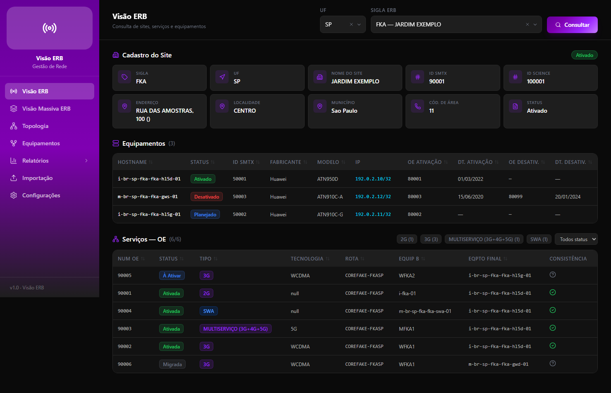
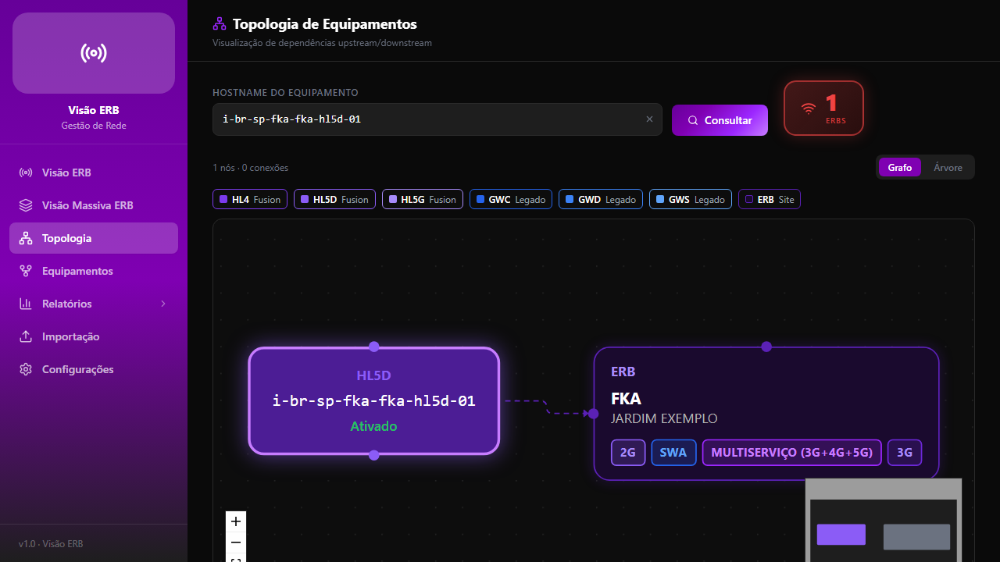
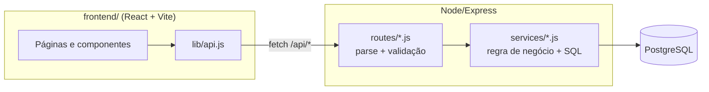

# Visão ERB

Aplicação web para gestão e visualização de infraestrutura de rede: sites (ERBs),
equipamentos de transporte, ordens de execução (OEs) e a topologia de dependências
entre eles. Dado o histórico de um site (sigla + UF), a aplicação cruza os
cadastros de equipamento com o status das OEs e sinaliza inconsistências —
por exemplo, uma OE marcada como "Ativada" cujo equipamento final ainda está
"Desativado".



> Os dados desta demo são **sintéticos** (sites, hostnames e IPs fictícios,
> IPs de faixa reservada para documentação — RFC 5737). O projeto foi
> originalmente construído para um domínio real de telecom e depois
> higienizado para publicação — veja [Como este projeto foi construído](#como-este-projeto-foi-construído).

## Funcionalidades

- **Visão ERB** — consulta por UF + sigla, cruzando ERB × equipamentos × OEs,
  com classificação automática de inconsistência (`ok`, `crítico`, `pendente`,
  `migrado`, `sem_eqpto`).
- **Visão Massiva** — mesma consulta, mas por equipamento final (todas as OEs
  que passam por um hostname).
- **Topologia** — grafo interativo (React Flow) das relações upstream/downstream
  entre equipamentos, com árvore recursiva resolvida no Postgres (`WITH RECURSIVE`).
- **Equipamentos** — gestão manual das relações de topologia (criar/editar/remover
  links, anotar portas).
- **Relatórios** — 7 relatórios operacionais (progresso de migração por UF,
  ERBs pendentes, serviços legado ainda ativos, etc.), cada um com filtro por UF.
- **Importação** — upload de CSV/XML (formato de exportação do sistema de origem)
  com upsert incremental.



## Stack

| Camada | Tecnologia |
|---|---|
| Frontend | React 19, React Router, Tailwind CSS, React Flow, Vite |
| Backend | Node.js, Express 5, Zod (validação) |
| Banco | PostgreSQL 16+ (usa colunas `GENERATED ALWAYS AS` para derivar `sigla_erb`/`uf_sigla_erb`) |
| Testes | Vitest, Supertest (integração contra Postgres real), Testing Library |
| CI | GitHub Actions |

## Arquitetura



Rotas HTTP (`routes/`) são finas: validam o input (Zod nos endpoints de
escrita) e delegam para a camada de serviço (`services/`), que concentra as
queries SQL e a lógica de classificação. Isso substitui um desenho anterior
onde as rotas continham SQL inline e duplicavam helpers de classificação —
ver o commit `refactor: introduce service layer`.

O build do frontend (`npm run build` dentro de `frontend/`) gera
`public/app/`, servido como estático pelo Express com fallback de SPA.
`public/app/` **não é versionado** — é gerado no build/deploy.

## Rodando localmente

Pré-requisitos: Node.js 20+, PostgreSQL 16+ (local ou Docker).

```bash
# 1. Instalar dependências (backend e frontend)
npm install
cd frontend && npm install && cd ..

# 2. Configurar ambiente
cp .env.example .env
# edite .env com as credenciais do seu Postgres

# 3. Build do frontend (gera public/app/)
cd frontend && npm run build && cd ..

# 4. Subir o servidor (cria as tabelas automaticamente no primeiro boot)
npm start
```

A aplicação sobe em `http://localhost:3000`. As tabelas (`erb`, `equipamentos`,
`oe`, `topologia`) são criadas automaticamente via `CREATE TABLE IF NOT EXISTS`
em `db.js`.

### Popular com dados de exemplo

Há um dataset sintético em `seed/` no formato que a importação espera. Suba o
app e faça upload de cada arquivo pela tela **Importação**, ou via curl:

```bash
curl -X POST http://localhost:3000/api/upload/erb -F "arquivo=@seed/erb.csv"
curl -X POST http://localhost:3000/api/upload/equipamentos -F "arquivo=@seed/equipamentos.csv"
curl -X POST http://localhost:3000/api/upload/oe -F "arquivo=@seed/oe.xml"
```

### Scripts de controle (dev diário)

O projeto tem scripts equivalentes para Linux (`app-control.sh`) e Windows
(`app-control.ps1`) — foi desenvolvido originalmente em AlmaLinux e depois
migrado para uso local em Windows, então os dois convivem mantendo paridade
de comandos:

```bash
./app-control.sh start|stop|restart|status|logs|open     # Linux/macOS
.\app-control.ps1 start|stop|restart|status|logs|open     # Windows (PowerShell)
```

Sem argumento, ambos abrem um menu interativo no terminal.

## Testes

Testes de integração do backend rodam contra um **Postgres real** (não
mockado) — decisão deliberada: um bug de schema real (colunas geradas
faltando em duas tabelas) só teria sido pego com um banco de verdade rodando
as queries, não com um mock do driver `pg`.

```bash
# Backend — sobe um Postgres de teste descartável via Docker
docker compose -f docker-compose.test.yml up -d
npm test

# Frontend
cd frontend && npm test
```

`test/setupEnv.js` carrega `.env.test` (credenciais de container local,
descartáveis, por isso versionado) antes de qualquer teste rodar, garantindo
que a suíte nunca toca no banco de desenvolvimento.

## Como este projeto foi construído

Sou dev júnior e usei ferramentas de IA generativa (Claude Code e Codex) como
parte real do meu fluxo de trabalho neste projeto — não para substituir
decisão técnica, mas para acelerar implementação, debugging, testes e
documentação depois que eu já sabia o que precisava ser feito e por quê.
Registro isso aqui porque acho mais honesto do que fingir que não usei, e
porque saber orquestrar essas ferramentas é uma habilidade tão real quanto
escrever o código à mão.

**O que foi decisão minha, do início ao fim:** a arquitetura do domínio (como
ERB, equipamentos, OEs e topologia se relacionam — inclusive a regra de
classificação de inconsistência que cruza status de OE com status de
equipamento), o que precisava ser corrigido antes de publicar, o escopo do
refactor, o que manter e o que descartar, e toda revisão do que a IA propôs.

**Onde a IA acelerou o trabalho, sob minha direção:**

- **Debugging real:** ao migrar o projeto de Linux para Windows, a aplicação
  carregava com tela preta. Investigação (com Playwright headless, direto no
  navegador) mostrou um `TypeError` no React causado por um endpoint da API
  retornando 500. A causa raiz era mais funda: `db.js` criava as tabelas
  `erb` e `equipamentos` sem as colunas `GENERATED ALWAYS AS` que derivam
  `sigla_erb`/`uf_sigla_erb` — colunas que o resto do código já assumia que
  existiam. Corrigido comparando o schema com um dump real do sistema
  original para confirmar a regra de derivação correta.
- Ainda durante o refactor de rotas, ao trocar o roteamento client-side
  hand-rolled por React Router, apareceu um **bug de produção pré-existente**:
  o prefixo de rota `/relatorios` era usado tanto pelo frontend (uma página)
  quanto pelo backend (a API de relatórios), então um refresh direto em
  `/relatorios/status-migracao-erb` fazia o Express responder com JSON em vez
  do HTML do React. Só ficou visível porque o React Router expôs a navegação
  por URL de um jeito que o roteador antigo mascarava. Corrigido movendo toda
  a API para `/api/*`.
- Um terceiro bug real surgiu **durante** o próprio refactor de dedup de
  componentes: mover a chamada de um hook (`useSortableTable`) para depois de
  um `return null` condicional violou as regras de hooks do React — pego pelo
  eslint, corrigido, e verificado visualmente antes do commit.
- Extração de duplicação (lógica de classificação repetida em 2-3 lugares no
  backend, mapas de cor/status repetidos em 3-5 componentes no frontend) e
  introdução de uma camada de serviço separando rotas HTTP de regra de
  negócio.
- Geração da suíte de testes (unitários + integração contra Postgres real)
  e do workflow de CI.
- Redação deste README.

Cada etapa foi testada manualmente (build, smoke test via navegador
automatizado, `curl` nos endpoints) antes de eu aceitar a mudança — nada foi
commitado sem eu confirmar que o comportamento estava correto.

## Estrutura

```
routes/         rotas Express — parse de input + validação (zod)
services/       regra de negócio, queries SQL, upsert de importação
lib/            utilitários pequenos (handler de erro centralizado)
db.js           pool de conexão + schema (CREATE TABLE IF NOT EXISTS)
app.js          app Express (exportado para testes via supertest)
server.js       entrypoint (initDatabase + app.listen)
frontend/       SPA React (Vite), build em public/app/
seed/           dataset sintético para popular a demo
test/           testes de integração do backend (vitest + supertest)
frontend/test/  testes de componentes/hooks do frontend
```
